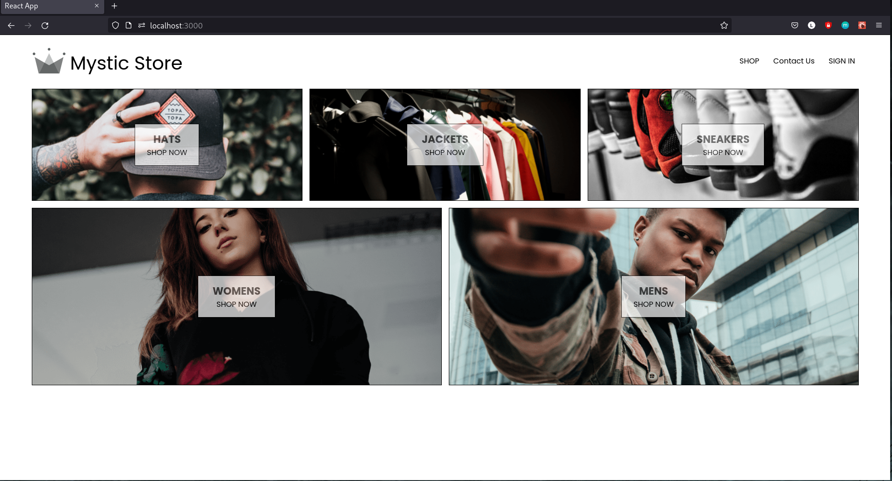
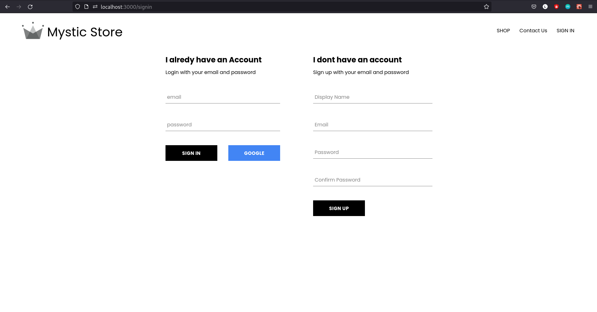
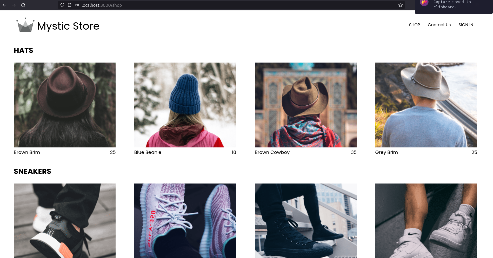

# Mystic Store (E-commerce site)
This project is to build an ecommerce site (fashion store) with react, redux, html, css.\
currently using firebase and later including node, express and mongodb as backend.

A glimpse at the work :point_down:

### Main Page

### Sign in and Sign up

### Shop Page

